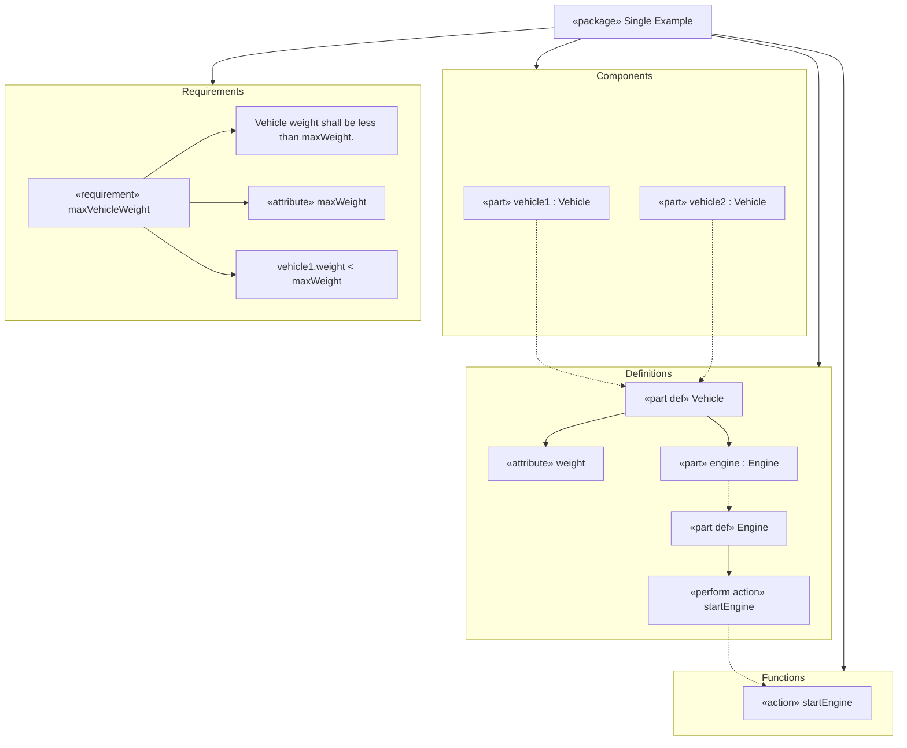

```mermaid
graph TD
  %% Packages
  A["«package» Single Example"]
  A1["«package» Definitions"]
  A2["«package» Components"]
  A3["«package» Functions"]
  A4["«package» Requirements"]

  A --> A1
  A --> A2
  A --> A3
  A --> A4

  %% Definitions
  subgraph A1 ["Definitions"]
    V["«part def» Vehicle"]
    E["«part def» Engine"]
    weight["«attribute» weight"]
    engine["«part» engine : Engine"]

    V --> weight
    V --> engine
    E --> SE["«perform action» startEngine"]
  end

  %% Functions
  subgraph A3 ["Functions"]
    startEngine["«action» startEngine"]
  end

  %% Components
  subgraph A2 ["Components"]
    v1["«part» vehicle1 : Vehicle"]
    v2["«part» vehicle2 : Vehicle"]
  end

  %% Requirements
  subgraph A4 ["Requirements"]
    R1["«requirement» maxVehicleWeight"]
    R1doc["Vehicle weight shall be less than maxWeight."]
    R1attr["«attribute» maxWeight"]
    R1constraint["vehicle1.weight < maxWeight"]

    R1 --> R1doc
    R1 --> R1attr
    R1 --> R1constraint
  end

  %% Typing relationships
  engine -.-> E
  v1 -.-> V
  v2 -.-> V
  SE -.-> startEngine
```